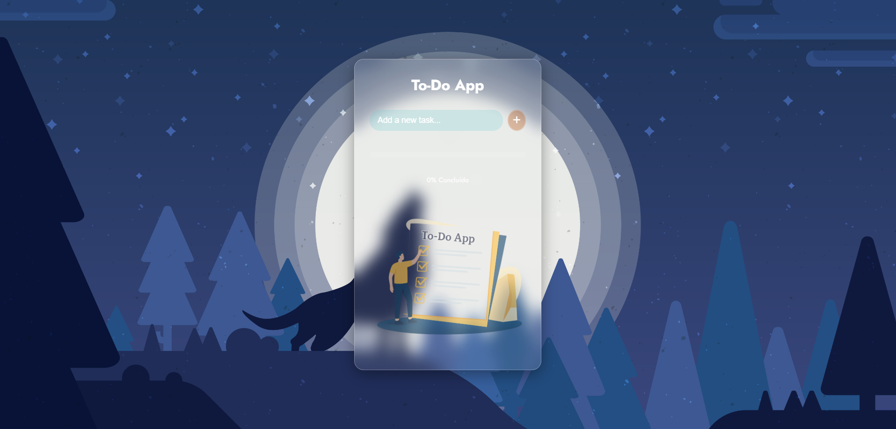

📝 To-Do List App  



---

📍 Description  
A simple, modern, and responsive to-do list application built with HTML, CSS, and Vanilla JavaScript.

Users can add, delete, and mark tasks as completed. The task list is saved automatically using the browser’s localStorage, so your tasks remain even after reloading the page.

---

🎯 Features  
✅ Add new tasks  
❌ Delete tasks  
✔️ Mark tasks as completed  
🧼 Clear all completed tasks  
💾 Auto-save with localStorage  
📱 Responsive design (desktop and mobile)

---

🧰 Technologies Used  
- HTML5  
- CSS3  
- JavaScript (Vanilla)  
- localStorage API

---

🌐 Live Preview  
➡️ 👉 [https://gustavohrdev.github.io/To-Do-List-App/](https://gustavohrdev.github.io/To-Do-List-App/)

---

🚀 How to Use  
1. Clone the repository:  
```bash
git clone https://github.com/GustavoHRdev/To-Do-List-.git

---

Open the index.html file in your browser.

Start managing your tasks efficiently!

📫 Contact
🌐 LinkedIn – Connect with me
🐱 GitHub – Check out more projects
📱 WhatsApp – Quick contact
